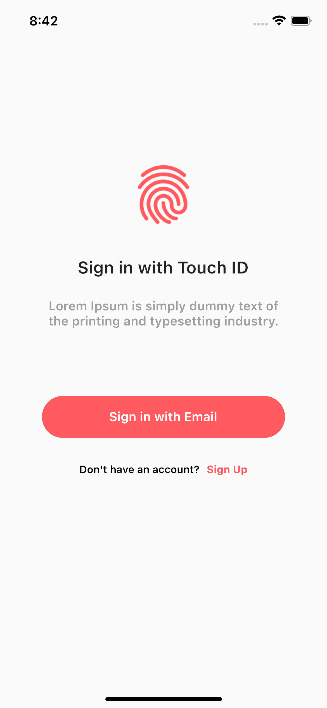
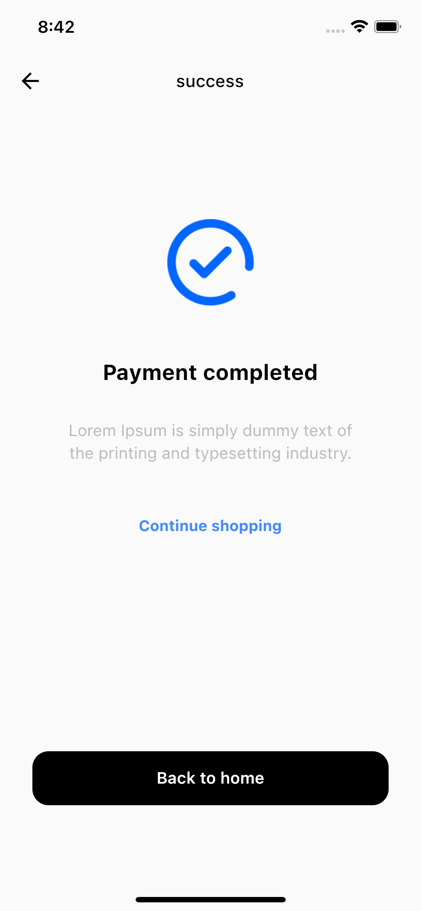
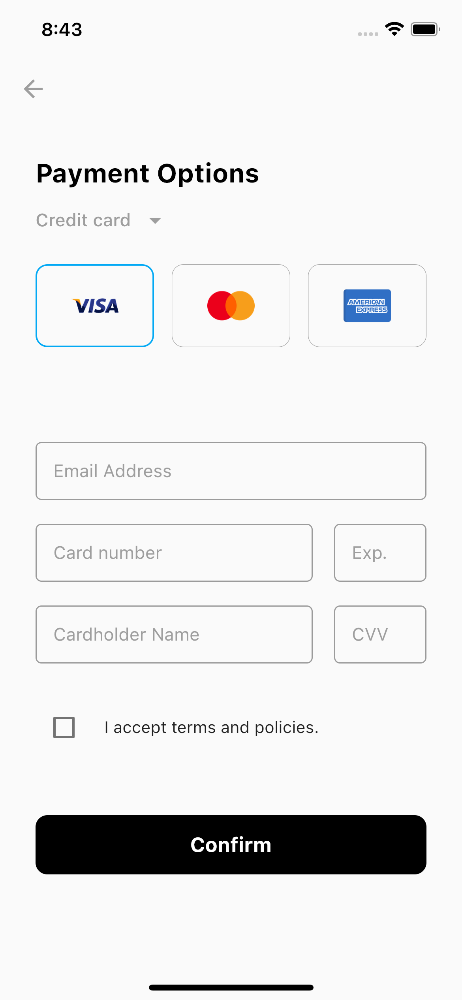

# flutter_ui_jumble
This repository is a collection of commonly used UIs for mobile applications.

## Screens it contains
👉 Sign In screen 
👉 Touch Id screen 
👉 Success screen 
and more...

 

               

## Attribution
<a href="https://www.flaticon.com/free-icons/folder" title="folder icons">Folder icons created by Kiranshastry - Flaticon</a> 

Photo by Sorasak on Unsplash (https://unsplash.com/photos/_UIN-pFfJ7c?utm_source=unsplash&utm_medium=referral&utm_content=creditShareLink)
 
